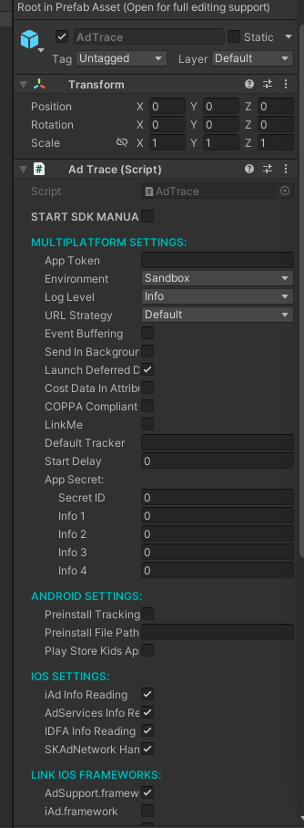

<p align="center"><a href="https://adtrace.io" target="_blank" rel="noopener noreferrer"></a></p>

<p align="center">
  <a href='https://opensource.org/licenses/MIT'></a>
</p>
## Summary

This is the Unity SDK of AdTrace.
 

## Table of contents

### Quick start

   * [Getting started](#qs-getting-started)
      * [Get the SDK](#qs-get-sdk)
      * [Add the SDK to your project](#qs-add-sdk)
      * [Integrate the SDK into your app](#qs-integrate-sdk)
      * [AdTrace logging](#qs-adtrace-logging)
      * [Google Play Services](#qs-gps)
      * [Proguard settings](#qs-android-proguard)
      * [Google Install Referrer](#qs-install-referrer)
      * [Huawei Referrer API](#qs-huawei-referrer-api)
      * [Post-build process](#qs-post-build-process)
        * [iOS post-build process](#qs-post-build-ios)
        * [Android post-build process](#qs-post-build-android)
      * [SDK signature](#qs-sdk-signature)

### Deeplinking

   * [Deeplinking overview](#dl)
   * [Standard deeplinking](#dl-standard)
      * [Deeplink handling in Android apps](#dl-app-android)
      * [Deeplink handling in iOS apps](#dl-app-ios)
   * [Deferred deeplinking](#dl-deferred)
      
### Event tracking

   * [Track event](#et-tracking)
   * [Track revenue](#et-revenue)
   * [Deduplicate revenue](#et-revenue-deduplication)

### Custom parameters

   * [Custom parameters overview](#cp)
   * [Event parameters](#cp-event-parameters)
      * [Event callback parameters](#cp-event-callback-parameters)
      * [Event partner parameters](#cp-event-partner-parameters)
      * [Event callback identifier](#cp-event-callback-id)
   * [Session parameters](#cp-session-parameters)
      * [Session callback parameters](#cp-session-callback-parameters)
      * [Session partner parameters](#cp-session-partner-parameters)
      * [Delay start](#cp-delay-start)

### Additional features

   * [AppTrackingTransparency framework](#ad-att-framework)
      * [App-tracking authorisation wrapper](#ad-ata-wrapper)
      * [Get current authorisation status](#ad-ata-getter)
      * [Check for ATT status change](#ad-att-status-change)
   * [SKAdNetwork framework](#ad-skadn-framework)
      * [Update SKAdNetwork conversion value](#ad-skadn-update-conversion-value)
      * [Conversion value updated callback](#ad-skadn-cv-updated-callback)
   * [Push token (uninstall tracking)](#ad-push-token)
   * [Attribution callback](#ad-attribution-callback)
   * [Ad revenue tracking](#ad-ad-revenue)
   * [Subscription tracking](#ad-subscriptions)
   * [Session and event callbacks](#ad-session-event-callbacks)
   * [User attribution](#ad-user-attribution)
   * [Device IDs](#ad-device-ids)
      * [iOS advertising identifier](#ad-idfa)
      * [Google Play Services advertising identifier](#ad-gps-adid)
      * [Amazon advertising identifier](#ad-amazon-adid)
      * [AdTrace device identifier](#ad-adid)
   * [Set external device ID](#set-external-device-id)
   * [Preinstalled apps](#ad-preinstalled-apps)
   * [Offline mode](#ad-offline-mode)
   * [Disable tracking](#ad-disable-tracking)
   * [Event buffering](#ad-event-buffering)
   * [Background tracking](#ad-background-tracking)
   * [GDPR right to be forgotten](#ad-gdpr-forget-me)
   * [Third-party sharing](#ad-third-party-sharing)
      * [Disable third-party sharing](#ad-disable-third-party-sharing)
      * [Enable third-party sharing](#ad-enable-third-party-sharing)
   * [Measurement consent](#ad-measurement-consent)
   * [Data residency](#ad-data-residency)
   * [COPPA compliance](#ad-coppa-compliance)
   * [Play Store Kids Apps](#ad-play-store-kids-apps)

### Testing and troubleshooting
   * [Debug information in iOS](#tt-debug-ios)

### License
  * [License agreement](#license)


## Quick start

### <a id="qs-getting-started"></a>Getting started

To integrate the AdTrace SDK into your Unity project, follow these steps.

### <a id="qs-get-sdk"></a>Get the SDK

You can download the latest version from our [releases page][releases].

### <a id="qs-add-sdk"></a>Add the SDK to your project

Open your project in the Unity Editor, go to `Assets → Import Package → Custom Package` and select the downloaded Unity package file.

### <a id="qs-integrate-sdk"></a>Integrate the SDK into your app

Add the prefab from `Assets/AdTrace/AdTrace.prefab` to the first scene.

You can edit the AdTrace script parameters in the prefab `Inspector menu` to set up varios options.



**Note:** You can chose to initialize AdTrace SDK in two different ways:

- Initialize it based on prefab settings you have set in inspector (for this to happen, you need to have `START SDK MANUALLY` option **not checked**).
- Initialize it from your app's code (for this to happen, you need to have `START SDK MANUALLY` option **checked**).

If you decide to proceed with initialization based on prefab settings in inspector, AdTrace SDK will be initialized as soon as `Awake` method of the scene you have added prefab to has been invoked.

Regardless of which way you pick, in order to initialize SDK, you will need to specify app token and environment. Follow [these steps](https://help.adtrace.com/en/panel/apps/app-settings#view-your-app-token) to find it in the panel. Depending on whether you are building your app for testing or for production, change the `Environment` setting to either 'Sandbox' or 'Production'.

**Important:** Set the value to `Sandbox` if you or someone else is testing your app. Make sure to set the `Environment` to `Production` before you publish the app. Set it back to `Sandbox` if you start testing again. Also, have in mind that by default AdTrace panel is showing production traffic of your app, so in case you want to see traffic you generated while testing in sandbox mode, make sure to switch to sandbox traffic view within panel.

We use the environment setting to distinguish between real traffic and artificial traffic from test devices. Please make sure to keep your environment setting updated.

In order to initialize SDK manually, make sure to do the following:

```cs
AdTraceConfig config = new AdTraceConfig("{YourAppToken}", AdTraceEnvironment.Sandbox);
AdTrace.start(config);
```

### <a id="qs-adtrace-logging"></a>AdTrace logging

You can increase or decrease the granularity of the logs you see by changing the value of `Log Level` to one of the following:

- `Verbose` - enable all logs
- `Debug` - disable verbose logs
- `Info` - disable debug logs (default)
- `Warn` - disable info logs
- `Error` - disable warning logs
- `Assert` - disable error logs
- `Suppress` - disable all logs

If you want to disable all of your log output when initializing the AdTrace SDK manually, set the log level to suppress and use a constructor for the `AdTraceConfig` object. This opens a boolean parameter where you can enter whether the suppress log level should be supported or not:

```cs
AdTraceConfig config = new AdTraceConfig("{YourAppToken}", AdTraceEnvironment.Sandbox, true);
config.setLogLevel(AdTraceLogLevel.Suppress);
AdTrace.start(config);
```

If your target is Windows-based and you want to see the compiled logs from our library in `Release` mode, redirect the log output to your app while testing it in `Debug` mode.

Call the method `setLogDelegate` in the `AdTraceConfig` instance before starting the SDK.

```cs
// ...
adtraceConfig.setLogDelegate(msg => Debug.Log(msg));
// ...
AdTrace.start(adtraceConfig);
```

### <a id="qs-gps"></a>Google Play Services

Since August 1st 2014, apps in the Google Play Store must use the [Google Advertising ID](https://developer.android.com/google/play-services/id.html) to uniquely identify devices. To allow the AdTrace SDK to use the Google Advertising ID, make sure to add latest version of [`play-services-ads-identifier`](https://mvnrepository.com/artifact/com.google.android.gms/play-services-ads-identifier?repo=google) AAR into the `Assets/Plugins/Android` folder of your Unity project.

If you are using `Google External Dependency Manager` plugin, you can also add this dependecy by stating it inside of your `Dependencies.xml` file:

```xml
<androidPackages>
    <androidPackage spec="com.google.android.gms:play-services-ads-identifier:18.0.1" />
</androidPackages>
```

#### Testing for the Google advertising ID
  
To check whether the AdTrace SDK is receiving the Google advertising ID, start your app by configuring the SDK to run in `sandbox` mode and set the log level to `verbose`. After that, track a session or an event in the app and check the list of parameters recorded in the verbose logs. If you see the `gps_adid` parameter, our SDK has successfully read the Google advertising ID.

If you encounter any issues getting the Google advertising ID, please open an issue in our Github repository or contact support@adtrace.com.

### <a id="qs-android-proguard"></a>Proguard settings

If you are using Proguard, add these lines to your Proguard file:

```
-keep class io.adtrace.sdk.** { *; }
-keep class com.google.android.gms.common.ConnectionResult {
    int SUCCESS;
}
-keep class com.google.android.gms.ads.identifier.AdvertisingIdClient {
    com.google.android.gms.ads.identifier.AdvertisingIdClient$Info getAdvertisingIdInfo(android.content.Context);
}
-keep class com.google.android.gms.ads.identifier.AdvertisingIdClient$Info {
    java.lang.String getId();
    boolean isLimitAdTrackingEnabled();
}
-keep public class com.android.installreferrer.** { *; }
```

### <a id="qs-install-referrer"></a>Google Install Referrer

In order to attribute the install of an Android app, AdTrace needs information about the Google install referrer. You can set up your app to get this by using the **Google Play Referrer API** or by catching the **Google Play Store intent** with a broadcast receiver. 

Google introduced the Google Play Referrer API in order to provide a more reliable and secure way than the Google Play Store intent to obtain install referrer information and to help attribution providers fight click injections. The Google Play Store intent will exist in parallel with the API temporarily, but is set to be deprecated in the future. We encourage you to support this. 

The AdTrace post-build process makes sure that SDK will be able to capture the Google Play Store intent; you need take a few additional steps to add support for the new Google Play Referrer API.

To add support for the Google Play Referrer API, download the latest [install referrer library](https://mvnrepository.com/artifact/com.android.installreferrer/installreferrer) AAR from Maven repository and place it into your `Plugins/Android` folder.

If you are using `Google External Dependency Manager` plugin, you can also add this dependecy by stating it inside of your `Dependencies.xml` file:

```xml
<androidPackages>
    <androidPackage spec="com.android.installreferrer:installreferrer:2.2" />
</androidPackages>
```

#### <a id="qs-huawei-referrer-api"></a>Huawei Referrer API

As of v2+, the AdTrace SDK supports install tracking on Huawei devices with Huawei App Gallery version 10.4 and higher. No additional integration steps are needed to start using the Huawei Referrer API.

### <a id="qs-post-build-process"></a>Post-build process

To complete the app build process, the AdTrace Unity package performs custom post-build actions to ensure the AdTrace SDK can work properly inside the app.

As of AdTrace SDK v2+, you can customize this process directly from inspector settings of the AdTrace prefab.


Log output messages describing the post build process are written to the Unity IDE console output window.

#### <a id="qs-post-build-ios"></a>iOS post-build process

When it comes to iOS post-build process, you have the ability to control which native iOS frameworks you would like to see linked with your app. Each one of these frameworks offers certain functionality which AdTrace SDK will take the advantage of, in case corresponding framework is linked with your app. Here is the list of frameworks you can select and short explanation why would you want to have them linked:

- `iAd.framework`: needed for Apple Search Ads tracking (deprecated API)
- `AdServices.framework`: needed for Apple Search Ads tracking (new API, available as of iOS 14.3)
- `AdSupport.framework`: needed for reading IDFA
- `AppTrackingTransparency.framework`: needed to ask for user's consent to be tracked and obtain status of that consent
- `StoreKit.framework`: needed for communication with SKAdNetwork framework

You can enter `User Tracking Description` message which will be displayed when you present tracking consent dialog to your user. More more information about this in [App-tracking authorisation wrapper](#ad-ata-wrapper) chapter.

You can also specify scheme based links as well as universal link domains associated with your iOS app. More information about this in [Deeplinking overview](#dl) chapter.

There are couple of things which iOS post-build process does by default and which you don't have control of. Those things are:

- Adding the other linker flag `-ObjC` (needed to recognize AdTrace Objective-C categories during build time)
- Enabling `Objective-C exceptions`

#### <a id="qs-post-build-android"></a>Android post-build process

The Android post-build process makes changes to the `AndroidManifest.xml` file located in `Assets/Plugins/Android/`. It also checks for the presence of the `AndroidManifest.xml` file in the Android plugins folder. If the file is not there, it creates a copy from our compatible manifest file `AdTraceAndroidManifest.xml`. If there you already have your own `AndroidManifest.xml` file (which should most probably be the case), you have the ability to select what actions will take place during the Android post-build process.

You can control which permissions you would like the post-build process to add to your `AndroidManifest.xml` file. Each one of these permission enables certain functionality which AdTrace SDK will take the advantage of, in case corresponding permission is added to your app. Here is the list of permissions you can select and short explanation why would you want to have them linked:

- `android.permission.INTERNET`: Needed for Internet connection (must be added).
- `android.permission.ACCESS_NETWORK_STATE`: Needed for reading type of network device is connected to.
- `com.google.android.finsky.permission.BIND_GET_INSTALL_REFERRER_SERVICE`: Needed for the new Google install referrer API to work.
- `com.google.android.gms.permission.AD_ID`: If you are targeting Android 12 and above (API level 31), you need to add this permission to read the Google's advertising ID. For more information, see [Google's `AdvertisingIdClient.Info` documentation](https://developers.google.com/android/reference/com/google/android/gms/ads/identifier/AdvertisingIdClient.Info#public-string-getid).

You can also specify scheme based links associated with your Android app. More information about this in [Deeplinking overview](#dl) chapter.

One thing which is automatically being done as part of Android post-build process is that it adds the AdTrace broadcast receiver (needed for getting install referrer information via Google Play Store intent). If you are using your own broadcast receiver to handle the `INSTALL_REFERRER` intent, you don't need to add the AdTrace broadcast receiver to your manifest file. Remove it, but add the call to the AdTrace broadcast receiver inside your own receiver, as described in the [Android guide](https://github.com/adtrace/android_sdk/blob/master/doc/english/referrer.md).

### <a id="qs-sdk-signature"></a>SDK signature

When you set up the SDK Signature, each SDK communication package is "signed". This lets AdTrace’s servers easily detect and reject any install activity that is not legitimate. 

There are just a few steps involved in setting up the SDK Signature. Please contact your Technical Account Manager or support@adtrace.com to get started.

## Deeplinking

### <a id="dl"></a>Deeplinking Overview

**We support deeplinking on iOS and Android platforms.**

If you are using AdTrace tracker URLs with deeplinking enabled, it is possible to receive information about the deeplink URL and its content. Users may interact with the URL regardless of whether they have your app installed on their device (standard deeplinking) or not (deferred deeplinking).

### <a id="dl-standard"></a>Standard deeplinking

Standard deeplinking is scenario in which click on a specific link opens your app which is already installed on user's device.

As of AdTrace SDK v2, [limited support](#why-limited-support) for deeplinking setup is bundled into iOS and Android post-build processes so that you don't need to jump to native Xcode and Android Studio projects and add that support manually.

**Important:** In case you already had deeplinking set up in your app to support AdTrace reattribution via deeplinks, you don't necessarily need to perform steps described in implementation chapters below for iOS and Android platforms. In case you had deeplinking support added to your apps and would like to switch to more convenient approach which AdTrace SDK v2 (or later version) is offering, then please make sure to:

- **For iOS platform:** Remove calls to `[AdTrace appWillOpenUrl:url];` method inside of your app's `AppDelegate` callbacks methods. This part will be automatically done if enabled in inspector menu of AdTrace SDK v2 or later.
- **For Android platform:** Remove calls to `AdTrace.appWillOpenUrl(url);` method inside of your app's default `Activity` class methods only if you are using `UNITY_2019_2_OR_NEWER` version. This part will be automatically done if enabled in inspector menu of AdTrace SDK v2 or later. If you are using lower Unity version, then make sure to leave native deeplinking support in your Android app project.

For more information, check how to enable deeplinking for [iOS](#dl-app-ios) and [Android](#dl-app-android) apps.

### <a id="dl-app-ios"></a>Deeplink handling in iOS apps

In order to set up deeplinking support for iOS platform, make sure to perform the following steps:

- **For scheme based links:** In the inspector, fill in `iOS URL Identifier` text field (this should usually be your iOS bundle ID) and inside of the `iOS URL Schemes` section, add all the schemes which you want your iOS app to handle. **Note:** Pay attention to tooltip which says that when you are entering schemes in the list, you should write them without `://` part at the end.
- **For universal links:** In the inspector, make sure to add each associated domain which your app handles into the `iOS Universal Links Domains` list. **Note:** Pay attention to tooltip which says that when you are entering universal links associated domains, you should write them without `applinks:` part in front of the domain (also without `https://`).

What iOS post-build process will perform under the hood will be swizzling of some of your app's default `AppDelegate` methods in order to intercept the link which has opened the app and then forward the call further up the hierarchy to your app's default `AppDelegate` callback method implementation. This implementation intercepts the links only to let AdTrace SDK know about them and SDK will perform everything which is needed to potentially reattribute your users via deeplinking. SDK does not offer any way of forwarding of deeplinks into Unity layer to be picked up in some custom callback method. If you would like to see information about deeplink captured inside of the Unity layer in your app, make sure to check [Application.deepLinkActivated](https://docs.unity3d.com/ScriptReference/Application-deepLinkActivated.html) method offered by Unity. Be aware that this method is available only as of `UNITY_2019_2_OR_NEWER`. If you would want to obtain information about iOS deeplink in earlier versions of Unity, you would need to implement this mechanism on your own.

### <a id="dl-app-android"></a>Deeplink handling in Android apps

In order to set up deeplinking support for Android platform, make sure to add all the schemes you would like your app to handle into the `Android URI Schemes` list. **Note:** Pay attention to tooltip which says that when you are entering URI schemes in the list, you should write them with `://` part at the end.

Unlike iOS counter part, Android post-build process will not perform any injection of custom Unity `Activity` class in order to intercept deeplinks which have opened your Android app. Instead, AdTrace SDK internally relies on above mentioned [Application.deepLinkActivated](https://docs.unity3d.com/ScriptReference/Application-deepLinkActivated.html) method to get information about deeplink directly from Unity API. SDK will automatically perform everything which is needed to potentially reattribute your users via deeplinking. And, like already mentioned above - feel free to implement this same method in order to obtain deeplink which has opened your Android app.

<a name="why-limited-support"></a>Above mentioned Android deeplinking support implementation is why it was said that support for deeplinking was limited - on Android platform this mechanism will work only on `UNITY_2019_2_OR_NEWER` versions of Unity. If you are using older version, you will need to add support for deeplinking on your own inside of your Android Studio app project. Information on how that should be done can be found in [official Android SDK README](https://github.com/adtrace/android_sdk#standard-deep-linking-scenario).

### <a id="dl-deferred"></a>Deferred deeplinking

In order to get content information about the deferred deeplink, set a callback method on the `AdTraceConfig` object. This will receive one `string` parameter where the content of the URL is delivered. Set this method on the config object by calling the method `setDeferredDeeplinkDelegate`:

```cs
// ...
private void DeferredDeeplinkCallback(string deeplinkURL) {
   Debug.Log("Deeplink URL: " + deeplinkURL);
   // ...
}

AdTraceConfig adtraceConfig = new AdTraceConfig("{YourAppToken}", AdTraceEnvironment.Sandbox);
adtraceConfig.setDeferredDeeplinkDelegate(DeferredDeeplinkCallback);
AdTrace.start(adtraceConfig);
```

<a id="deeplinking-deferred-open"></a>With deferred deeplinking, there is an additional setting you can set on the `AdTraceConfig` object. Once the AdTrace SDK gets the deferred deeplink information, you can choose whether our SDK should open the URL or not. You can set this option by calling the `setLaunchDeferredDeeplink` method on the config object:

```cs
// ...
private void DeferredDeeplinkCallback(string deeplinkURL) {
   Debug.Log ("Deeplink URL: " + deeplinkURL);
   // ...
}

AdTraceConfig adtraceConfig = new AdTraceConfig("{YourAppToken}", AdTraceEnvironment.Sandbox);
adtraceConfig.setLaunchDeferredDeeplink(true);
adtraceConfig.setDeferredDeeplinkDelegate(DeferredDeeplinkCallback);
AdTrace.start(adtraceConfig);
```

If nothing is set, **the AdTrace SDK will always try to launch the URL by default**.

## Event tracking

### <a id="et-tracking"></a>Track an event

You can use AdTrace to track any event in your app. If you want to track every tap on a button, [create a new event token](https://help.adtrace.com/en/tracking/in-app-events/basic-event-setup#generate-event-tokens-in-the-adtrace-panel) in your panel. Let's say that the event token is `abc123`. In your button's click handler method, add the following lines to track the click:

```cs
AdTraceEvent adtraceEvent = new AdTraceEvent("abc123");
AdTrace.trackEvent(adtraceEvent);
```

### <a id="et-revenue"></a>Track revenue

If your users generate revenue by engaging with advertisements or making in-app purchases, you can track this with events. For example: if one add tap is worth one Euro cent, you can track the revenue event like this:

```cs
AdTraceEvent adtraceEvent = new AdTraceEvent("abc123");
adtraceEvent.setRevenue(23000, "Toman");
AdTrace.trackEvent(adtraceEvent);
```

When you set a currency token, AdTrace will automatically convert the incoming revenues using the openexchange API into a reporting revenue of your choice. [Read more about currency conversion here](http://help.adtrace.com/tracking/revenue-events/currency-conversion).

If you want to track in-app purchases, please make sure to call `trackEvent` only if the purchase is finished and the item has been purchased. This is important in order to avoid tracking revenue your users did not actually generate.

### <a id="et-revenue-deduplication"></a>Revenue deduplication

Add an optional transaction ID to avoid tracking duplicated revenues. The SDK remembers the last ten transaction IDs and skips revenue events with duplicate transaction IDs. This is especially useful for tracking in-app purchases. 

```cs
AdTraceEvent adtraceEvent = new AdTraceEvent("abc123");
adtraceEvent.setRevenue(0.01, "EUR");
adtraceEvent.setTransactionId("transactionId");
AdTrace.trackEvent(adtraceEvent);
```

## Custom parameters

### <a id="cp"></a>Custom parameters overview

In addition to the data points the AdTrace SDK collects by default, you can use the AdTrace SDK to track and add as many custom values as you need (user IDs, product IDs, etc.) to the event or session. Custom parameters are only available as raw data and will **not** appear in your AdTrace panel.

Use [callback parameters](https://help.adtrace.com/en/manage-data/export-raw-data/callbacks/best-practices-callbacks) for the values you collect for your own internal use, and partner parameters for those you share with external partners. If a value (e.g. product ID) is tracked both for internal use and external partner use, we recommend using both callback and partner parameters.

### <a id="cp-event-parameters"></a>Event parameters

### <a id="cp-event-callback-parameters"></a>Event callback parameters

If you register a callback URL for events in your [panel], we will send a GET request to that URL whenever the event is tracked. You can also put key-value pairs in an object and pass it to the `trackEvent` method. We will then append these parameters to your callback URL.

For example, if you've registered the URL `http://www.example.com/callback`, then you would track an event like this:

```cs
AdTraceEvent adtraceEvent = new AdTraceEvent("abc123");
adtraceEvent.addCallbackParameter("key", "value");
adtraceEvent.addCallbackParameter("foo", "bar");
AdTrace.trackEvent(adtraceEvent);
```

In this case we would track the event and send a request to:

```
http://www.example.com/callback?key=value&foo=bar
```

AdTrace supports a variety of placeholders, for example `{idfa}` for iOS or `{gps_adid}` for Android, which can be used as parameter values.  Using this example, in the resulting callback we would replace the placeholder with the IDFA/ Google Play Services ID of the current device. Read more about [real-time callbacks](https://help.adtrace.com/en/manage-data/export-raw-data/callbacks) and see our full list of [placeholders](https://partners.adtrace.com/placeholders/). 

**Note:** We don't store any of your custom parameters. We only append them to your callbacks. If you haven't registered a callback for an event, we will not read these parameters.

### <a id="cp-event-value-parameters"></a>Event value parameters

Once your parameters are activated in the panel, you can send them to your network partners. Read more about [module partners](https://docs.adtrace.com/en/special-partners/) and their extended integration.

This works the same way as callback parameters; add them by calling the `addValueParameter` method on your `AdTraceEvent` instance.

```cs
AdTraceEvent adtraceEvent = new AdTraceEvent("abc123");
adtraceEvent.addValueParameter("key", "value");
adtraceEvent.addValueParameter("foo", "bar");
AdTrace.trackEvent(adtraceEvent);
```

You can read more about special partners and these integrations in our [guide to special partners][special-partners].

### <a id="cp-event-callback-id"></a>Event callback identifier

You can add custom string identifiers to each event you want to track. We report this identifier in your event callbacks, letting you know which event was successfully tracked. Set the identifier by calling the `setCallbackId` method on your `AdTraceEvent` instance:

```cs
AdTraceEvent adtraceEvent = new AdTraceEvent("abc123");
adtraceEvent.setCallbackId("Your-Custom-Id");
AdTrace.trackEvent(adtraceEvent);
```

### <a id="cp-session-parameters"></a>Session parameters

Session parameters are saved locally and sent with every AdTrace SDK **event and session**. Whenever you add these parameters, we save them (so you don't need to add them again). Adding the same parameter twice will have no effect.

It's possible to send session parameters before the AdTrace SDK has launched. Using the [SDK delay](#cp-delay-start), you can therefore retrieve additional values (for instance, an authentication token from the app's server), so that all information can be sent at once with the SDK's initialization. 

### <a id="cp-session-callback-parameters"></a>Session callback parameters

You can save event callback parameters to be sent with every AdTrace SDK session.

The session callback parameters' interface is similar to the one for event callback parameters. Instead of adding the key and its value to an event, add them via a call to the `addSessionCallbackParameter` method of the `AdTrace` instance:

```cs
AdTrace.addSessionCallbackParameter("foo", "bar");
```

Session callback parameters merge with event callback parameters, sending all of the information as one, but event callback parameters take precedence over session callback parameters. If you add an event callback parameter with the same key as a session callback parameter, we will show the event value.

You can remove a specific session callback parameter by passing the desired key to the `removeSessionCallbackParameter` method of the `AdTrace` instance.

```cs
AdTrace.removeSessionCallbackParameter("foo");
```

To remove all keys and their corresponding values from the session callback parameters, you can reset them with the `resetSessionCallbackParameters` method of the `AdTrace` instance.

```cs
AdTrace.resetSessionCallbackParameters();
```

### <a id="cp-session-partner-parameters"></a>Session partner parameters

In the same way that [session callback parameters](#cp-session-callback-parameters) are sent with every event or session that triggers our SDK, there are also session partner parameters.

These are transmitted to network partners for all of the integrations activated in your [panel].

The session partner parameters interface is similar to the event partner parameters interface, however instead of adding the key and its value to an event, add it by calling the `addSessionPartnerParameter` method of the `AdTrace` instance.

```cs
AdTrace.addSessionPartnerParameter("foo", "bar");
```

Session partner parameters merge with event partner parameters. However, event partner parameters take precedence over session partner parameters. If you add an event partner parameter with the same key as a session partner parameter, we will show the event value.

To remove a specific session partner parameter, pass the desired key to the `removeSessionPartnerParameter` method of the `AdTrace` instance.

```cs
AdTrace.removeSessionPartnerParameter("foo");
```

To remove all keys and their corresponding values from the session partner parameters, reset it with the `resetSessionPartnerParameters` method of the `AdTrace` instance.

```cs
AdTrace.resetSessionPartnerParameters();
```

### <a id="cp-delay-start"></a>Delay start

Delaying the start of the AdTrace SDK gives your app time to receive any session parameters (such as unique identifiers) you may want to send on install.

Set the initial delay time in seconds with the method `setDelayStart` in the `AdTraceConfig` instance:

```cs
adtraceConfig.setDelayStart(5.5);
```

In this example, the AdTrace SDK is prevented from sending the initial install session and any new event for 5.5 seconds. After 5.5 seconds (or if you call `AdTrace.sendFirstPackages()` during that time), every session parameter is added to the delayed install session and events, and the AdTrace SDK will work as usual.

You can delay the start time of the AdTrace SDK for a maximum of 10 seconds.

## Additional features

Once you integrate the AdTrace SDK into your project, you can take advantage of the following features:

### <a id="ad-att-framework"></a>AppTrackingTransparency framework

**Note**: This feature exists only in iOS platform.

For each package sent, the AdTrace backend receives one of the following four (4) states of consent for access to app-related data that can be used for tracking the user or the device:

- Authorized
- Denied
- Not Determined
- Restricted

After a device receives an authorization request to approve access to app-related data, which is used for user device tracking, the returned status will either be Authorized or Denied.

Before a device receives an authorization request for access to app-related data, which is used for tracking the user or device, the returned status will be Not Determined.

If authorization to use app tracking data is restricted, the returned status will be Restricted.

The SDK has a built-in mechanism to receive an updated status after a user responds to the pop-up dialog, in case you don't want to customize your displayed dialog pop-up. To conveniently and efficiently communicate the new state of consent to the backend, AdTrace SDK offers a wrapper around the app tracking authorization method described in the following chapter, App-tracking authorization wrapper.

### <a id="ad-ata-wrapper"></a>App-tracking authorisation wrapper

**Note**: This feature exists only in iOS platform.

AdTrace SDK offers the possibility to use it for requesting user authorization in accessing their app-related data. AdTrace SDK has a wrapper built on top of the [requestTrackingAuthorizationWithCompletionHandler:](https://developer.apple.com/documentation/apptrackingtransparency/attrackingmanager/3547037-requesttrackingauthorizationwith?language=objc) method, where you can as well define the callback method to get information about a user's choice. In order for this method to work, you need to specify a text which is going to be displayed as part of the tracking request dialog to your user. This setting is located inside of your iOS app `Info.plist` file under `NSUserTrackingUsageDescription` key. In case you don't want to add specify this on your own in your Xcode project, you can check AdTrace prefab settings in inspector and specify this text under `User Tracking Description`. If specified there, AdTrace iOS post-build process will make sure to add this setting into your app's `Info.plist` file.

Also, with the use of this wrapper, as soon as a user responds to the pop-up dialog, it's then communicated back using your callback method. The SDK will also inform the backend of the user's choice. The `NSUInteger` value will be delivered via your callback method with the following meaning:

- 0: `ATTrackingManagerAuthorizationStatusNotDetermined`
- 1: `ATTrackingManagerAuthorizationStatusRestricted`
- 2: `ATTrackingManagerAuthorizationStatusDenied`
- 3: `ATTrackingManagerAuthorizationStatusAuthorized`

To use this wrapper, you can call it as such:

```cs
AdTrace.requestTrackingAuthorizationWithCompletionHandler((status) =>
{
    switch (status)
    {
        case 0:
            // ATTrackingManagerAuthorizationStatusNotDetermined case
            break;
        case 1:
            // ATTrackingManagerAuthorizationStatusRestricted case
            break;
        case 2:
            // ATTrackingManagerAuthorizationStatusDenied case
            break;
        case 3:
            // ATTrackingManagerAuthorizationStatusAuthorized case
            break;
    }
});
```

### <a id="ad-ata-getter"></a>Get current authorisation status

**Note**: This feature exists only in iOS platform.

To get the current app tracking authorization status you can call `getAppTrackingAuthorizationStatus` method of `AdTrace` class that will return one of the following possibilities:

* `0`: The user hasn't been asked yet
* `1`: The user device is restricted
* `2`: The user denied access to IDFA
* `3`: The user authorized access to IDFA
* `-1`: The status is not available

### <a id="ad-att-status-change"></a>Check for ATT status change

In cases where you are not using [AdTrace app-tracking authorization wrapper](#ad-ata-wrapper), AdTrace SDK will not be able to know immediately upon answering the dialog what is the new value of app-tracking status. In situations like this, if you would want AdTrace SDK to read the new app-tracking status value and communicate it to our backend, make sure to make a call to this method:

```cs
AdTrace.checkForNewAttStatus();
```

### <a id="ad-skadn-framework"></a>SKAdNetwork framework

**Note**: This feature exists only in iOS platform.

If you have implemented the AdTrace iOS SDK v2+ or above and your app is running on iOS 14 and above, the communication with SKAdNetwork will be set on by default, although you can choose to turn it off. When set on, AdTrace automatically registers for SKAdNetwork attribution when the SDK is initialized. If events are set up in the AdTrace panel to receive conversion values, the AdTrace backend sends the conversion value data to the SDK. The SDK then sets the conversion value. After AdTrace receives the SKAdNetwork callback data, it is then displayed in the panel.

In case you don't want the AdTrace SDK to automatically communicate with SKAdNetwork, you can disable that by calling the following method on configuration object:

```cs
adtraceConfig.deactivateSKAdNetworkHandling();
```

### <a id="ad-skadn-update-conversion-value"></a>Update SKAdNetwork conversion value

**Note**: This feature exists only in iOS platform.

You can use AdTrace SDK wrapper method `updateConversionValue` to update SKAdNetwork conversion value for your user:

```cs
AdTrace.updateConversionValue(6);
```

### <a id="ad-skadn-cv-updated-callback"></a>Conversion value updated callback

You can register callback to get notified each time when AdTrace SDK updates conversion value for the user.

```cs
using io.adtrace.sdk;

public class ExampleGUI : MonoBehaviour {
    void OnGUI() {
        if (GUI.Button(new Rect(0, 0, Screen.width, Screen.height), "callback")) {
            AdTraceConfig adtraceConfig = new AdTraceConfig("{Your App Token}", AdTraceEnvironment.Sandbox);
            adtraceConfig.setLogLevel(AdTraceLogLevel.Verbose);
            adtraceConfig.setConversionValueUpdatedDelegate(ConversionValueUpdatedCallback);

            AdTrace.start(adtraceConfig);
        }
    }

    private void ConversionValueUpdatedCallback(int conversionValue)
    {
        Debug.Log("Conversion value update reported!");
        Debug.Log("Conversion value: " + conversionValue);
    }
}
```

### <a id="ad-push-token"></a>Push token (uninstall tracking)

Push tokens are used for Audience Builder and client callbacks; they are also required for uninstall and reinstall tracking.

To send us a push notification token, call the `setDeviceToken` method on the `AdTrace` instance when you obtain your app's push notification token (or whenever its value changes):

```cs
AdTrace.setDeviceToken("YourPushNotificationToken");
```

### <a id="ad-attribution-callback"></a>Attribution callback

You can set up a callback to be notified about attribution changes. We consider a variety of different sources for attribution, so we provide this information asynchronously. Make sure to consider [applicable attribution data policies][attribution_data] before sharing any of your data with third-parties. 

Follow these steps to add the optional callback in your application:

1. Create a method with the signature of the delegate `Action<AdTraceAttribution>`.

2. After creating the `AdTraceConfig` object, call the `adtraceConfig.setAttributionChangedDelegate` with the previously created method. You can also use a lambda with the same signature.

3. If instead of using the `AdTrace.prefab` the `AdTrace.cs` script was added to another `GameObject`, be sure to pass the name of the `GameObject` as the second parameter of `AdTraceConfig.setAttributionChangedDelegate`.

Because the callback is configured using the `AdTraceConfig` instance, call `adtraceConfig.setAttributionChangedDelegate` before calling `AdTrace.start`.

```cs
using io.adtrace.sdk;

public class ExampleGUI : MonoBehaviour {
    void OnGUI() {
        if (GUI.Button(new Rect(0, 0, Screen.width, Screen.height), "callback")) {
            AdTraceConfig adtraceConfig = new AdTraceConfig("{Your App Token}", AdTraceEnvironment.Sandbox);
            adtraceConfig.setLogLevel(AdTraceLogLevel.Verbose);
            adtraceConfig.setAttributionChangedDelegate(this.attributionChangedDelegate);
            AdTrace.start(adtraceConfig);
        }
    }

    public void attributionChangedDelegate(AdTraceAttribution attribution) {
        Debug.Log("Attribution changed");
        // ...
    }
}
```

The callback function will be called when the SDK receives final attribution data. Within the callback function you have access to the `attribution` parameter. Here is a quick summary of its properties:

- `string trackerToken` the tracker token of the current attribution
- `string trackerName` the tracker name of the current attribution
- `string network` the network grouping level of the current attribution
- `string campaign` the campaign grouping level of the current attribution
- `string adgroup` the ad group grouping level of the current attribution
- `string creative` the creative grouping level of the current attribution
- `string clickLabel` the click label of the current attribution
- `string adid` the AdTrace device identifier
- `string costType` the cost type string
- `double? costAmount` the cost amount
- `string costCurrency` the cost currency string

**Note**: The cost data - `costType`, `costAmount` & `costCurrency` are only available when configured in `AdTraceConfig` by calling `setNeedsCost` method. If not configured or configured, but not being part of the attribution, these fields will have value `null`. This feature is available in SDK v2+ and above.

### <a id="ad-ad-revenue"></a>Ad revenue tracking

**Note**: This ad revenue tracking API is available only in the native SDK v2+ and above.

You can track ad revenue information with AdTrace SDK by invoking the following method:

```objc
// initialise with AppLovin MAX source
AdTraceAdRevenue adtraceAdRevenue = new AdTraceAdRevenue("source");
// set revenue and currency
adtraceAdRevenue.setRevenue(1.00, "USD");
// optional parameters
adtraceAdRevenue.setAdImpressionsCount(10);
adtraceAdRevenue.setAdRevenueNetwork("network");
adtraceAdRevenue.setAdRevenueUnit("unit");
adtraceAdRevenue.setAdRevenuePlacement("placement");
// callback & partner parameters
adtraceAdRevenue.addCallbackParameter("key", "value");
adtraceAdRevenue.addPartnerParameter("key", "value");
// track ad revenue
AdTrace.trackAdRevenue(adtraceAdRevenue);
```

Currently we support the below `source` parameter values:

- `AdTraceConfig.AdTraceAdRevenueSourceAppLovinMAX` - representing AppLovin MAX platform.
- `AdTraceConfig.AdTraceAdRevenueSourceMopub` - representing MoPub platform.
- `AdTraceConfig.AdTraceAdRevenueSourceAdMob` - representing AdMob platform.
- `AdTraceConfig.AdTraceAdRevenueSourceIronSource` - representing IronSource platform.
- `AdTraceConfig.AdTraceAdRevenueSourceUnity` - representing Unity platform.
- `AdTraceConfig.AdTraceAdRevenueSourceHeliumChartboost` - representing Helium Chartboost platform.

**Note**: Additional documentation which explains detailed integration with every of the supported sources will be provided outside of this README. Also, in order to use this feature, additional setup is needed for your app in AdTrace panel, so make sure to get in touch with our support team to make sure that everything is set up correctly before you start to use this feature.

### <a id="ad-subscriptions"></a>Subscription tracking

**Note**: This feature is only available in the SDK v2+ and above.

You can track App Store and Play Store subscriptions and verify their validity with the AdTrace SDK. After a subscription has been successfully purchased, make the following call to the AdTrace SDK:

**For App Store subscription:**

```cs
AdTraceAppStoreSubscription subscription = new AdTraceAppStoreSubscription(
    price,
    currency,
    transactionId,
    receipt);
subscription.setTransactionDate(transactionDate);
subscription.setSalesRegion(salesRegion);

AdTrace.trackAppStoreSubscription(subscription);
```

**For Play Store subscription:**

```cs
AdTracePlayStoreSubscription subscription = new AdTracePlayStoreSubscription(
    price,
    currency,
    sku,
    orderId,
    signature,
    purchaseToken);
subscription.setPurchaseTime(purchaseTime);

AdTrace.trackPlayStoreSubscription(subscription);
```

Subscription tracking parameters for App Store subscription:

- [price](https://developer.apple.com/documentation/storekit/skproduct/1506094-price?language=objc)
- currency (you need to pass [currencyCode](https://developer.apple.com/documentation/foundation/nslocale/1642836-currencycode?language=objc) of the [priceLocale](https://developer.apple.com/documentation/storekit/skproduct/1506145-pricelocale?language=objc) object)
- [transactionId](https://developer.apple.com/documentation/storekit/skpaymenttransaction/1411288-transactionidentifier?language=objc)
- receipt(you need to pass properly formatted JSON `receipt` field of your purchased object returned from Unity IAP API)
- [transactionDate](https://developer.apple.com/documentation/storekit/skpaymenttransaction/1411273-transactiondate?language=objc)
- salesRegion (you need to pass [countryCode](https://developer.apple.com/documentation/foundation/nslocale/1643060-countrycode?language=objc) of the [priceLocale](https://developer.apple.com/documentation/storekit/skproduct/1506145-pricelocale?language=objc) object)

Subscription tracking parameters for Play Store subscription:

- [price](https://developer.android.com/reference/com/android/billingclient/api/SkuDetails#getpriceamountmicros)
- [currency](https://developer.android.com/reference/com/android/billingclient/api/SkuDetails#getpricecurrencycode)
- [sku](https://developer.android.com/reference/com/android/billingclient/api/Purchase#getsku)
- [orderId](https://developer.android.com/reference/com/android/billingclient/api/Purchase#getorderid)
- [signature](https://developer.android.com/reference/com/android/billingclient/api/Purchase#getsignature)
- [purchaseToken](https://developer.android.com/reference/com/android/billingclient/api/Purchase#getpurchasetoken)
- [purchaseTime](https://developer.android.com/reference/com/android/billingclient/api/Purchase#getpurchasetime)

**Note:** Subscription tracking API offered by AdTrace SDK expects all parameters to be passed as `string` values. Parameters described above are the ones which API exects you to pass to subscription object prior to tracking subscription. There are various libraries which are handling in app purchases in Unity and each one of them should return information described above in some form upon successfully completed subscription purchase. You should locate where these parameters are placed in response you are getting from library you are using for in app purchases, extract those values and pass them to AdTrace API as string values.

Just like with event tracking, you can attach callback and partner parameters to the subscription object as well:

**For App Store subscription:**

```cs
AdTraceAppStoreSubscription subscription = new AdTraceAppStoreSubscription(
    price,
    currency,
    transactionId,
    receipt);
subscription.setTransactionDate(transactionDate);
subscription.setSalesRegion(salesRegion);

// add callback parameters
subscription.addCallbackParameter("key", "value");
subscription.addCallbackParameter("foo", "bar");

// add partner parameters
subscription.addPartnerParameter("key", "value");
subscription.addPartnerParameter("foo", "bar");

AdTrace.trackAppStoreSubscription(subscription);
```

**For Play Store subscription:**

```cs
AdTracePlayStoreSubscription subscription = new AdTracePlayStoreSubscription(
    price,
    currency,
    sku,
    orderId,
    signature,
    purchaseToken);
subscription.setPurchaseTime(purchaseTime);

// add callback parameters
subscription.addCallbackParameter("key", "value");
subscription.addCallbackParameter("foo", "bar");

// add partner parameters
subscription.addPartnerParameter("key", "value");
subscription.addPartnerParameter("foo", "bar");

AdTrace.trackPlayStoreSubscription(subscription);
```

### <a id="ad-session-event-callbacks"></a>Session and event callbacks

You can set up callbacks to notify you of successful and failed events and/or sessions.

Follow these steps to add the callback function for successfully tracked events:

```cs
// ...
AdTraceConfig adtraceConfig = new AdTraceConfig("{Your App Token}", AdTraceEnvironment.Sandbox);
adtraceConfig.setLogLevel(AdTraceLogLevel.Verbose);
adtraceConfig.setEventSuccessDelegate(EventSuccessCallback);
AdTrace.start(adtraceConfig);

// ...
public void EventSuccessCallback(AdTraceEventSuccess eventSuccessData) {
    // ...
}
```

Add the following callback function for failed tracked events:

```cs
// ...
AdTraceConfig adtraceConfig = new AdTraceConfig("{Your App Token}", AdTraceEnvironment.Sandbox);
adtraceConfig.setLogLevel(AdTraceLogLevel.Verbose);
adtraceConfig.setEventFailureDelegate(EventFailureCallback);
AdTrace.start(adtraceConfig);

// ...
public void EventFailureCallback(AdTraceEventFailure eventFailureData) {
    // ...
}
```

For successfully tracked sessions:

```cs
// ...
AdTraceConfig adtraceConfig = new AdTraceConfig("{Your App Token}", AdTraceEnvironment.Sandbox);
adtraceConfig.setLogLevel(AdTraceLogLevel.Verbose);
adtraceConfig.setSessionSuccessDelegate(SessionSuccessCallback);
AdTrace.start(adtraceConfig);

// ...
public void SessionSuccessCallback (AdTraceSessionSuccess sessionSuccessData) {
    // ...
}
```

For failed tracked sessions:

```cs
// ...
AdTraceConfig adtraceConfig = new AdTraceConfig("{Your App Token}", AdTraceEnvironment.Sandbox);
adtraceConfig.setLogLevel(AdTraceLogLevel.Verbose);
adtraceConfig.setSessionFailureDelegate(SessionFailureCallback);
AdTrace.start(adtraceConfig);

// ...
public void SessionFailureCallback (AdTraceSessionFailure sessionFailureData) {
    // ...
}
```

Callback functions will be called after the SDK tries to send a package to the server. Within the callback you have access to a response data object specifically for the callback. Here is a quick summary of the session response data properties:

- `string Message` the message from the server or the error logged by the SDK
- `string Timestamp` timestamp from the server
- `string Adid` a unique device identifier provided by AdTrace
- `Dictionary<string, object> JsonResponse` the JSON object with the response from the server

Both event response data objects contain:

- `string EventToken` the event token, if the package tracked was an event
- `string CallbackId` the custom defined callback ID set on an event object

Both event and session failed objects also contain:

- `bool WillRetry` indicates there will be an attempt to resend the package at a later time

### <a id="ad-user-attribution"></a>User attribution

This callback, like an attribution callback, is triggered whenever the attribution information changes. Access your user's current attribution information whenever you need it by calling the following method of the `AdTrace` instance:

```cs
AdTraceAttribution attribution = AdTrace.getAttribution();
```

**Note**: Current attribution information is available after our backend tracks the app install and triggers the attribution callback. It is not possible to access a user's attribution value before the SDK has been initialized and the attribution callback has been triggered.

### <a id="ad-device-ids"></a>Device IDs

The AdTrace SDK lets you receive device identifiers.

### <a id="ad-idfa">iOS Advertising Identifier

To obtain the IDFA, call the function `getIdfa` of the `AdTrace` instance:

```cs
string idfa = AdTrace.getIdfa();
```

### <a id="ad-gps-adid"></a>Google Play Services advertising identifier
  
The Google Play Services Advertising Identifier (Google advertising ID) is a unique identifier for a device. Users can opt out of sharing their Google advertising ID by toggling the "Opt out of Ads Personalization" setting on their device. When a user has enabled this setting, the AdTrace SDK returns a string of zeros when trying to read the Google advertising ID.
  
> **Important**: If you are targeting Android 12 and above (API level 31), you need to add the [`com.google.android.gms.AD_ID` permission](#gps-adid-permission) to your app. If you do not add this permission, you will not be able to read the Google advertising ID even if the user has not opted out of sharing their ID.

The Google advertising ID can only be read in a background thread. If you call the method `getGoogleAdId` of the `AdTrace` instance with an `Action<string>` delegate, it will work in any situation:

```cs
AdTrace.getGoogleAdId((string googleAdId) => {
    // ...
});
```

You will now have access to the Google advertising ID as the variable `googleAdId`.

### <a id="ad-amazon-adid"></a>Amazon advertising identifier

If you need to get the Amazon advertising ID, call the `getAmazonAdId` method on `AdTrace` instance:

```cs
string amazonAdId = AdTrace.getAmazonAdId();
```

### <a id="ad-adid"></a>AdTrace device identifier

Our backend generates a unique AdTrace device identifier (known as an `adid`) for every device that has your app installed. In order to get this identifier, call this method on `AdTrace` instance:

```cs
String adid = AdTrace.getAdid();
```

Information about the adid is only available after our backend tracks the app install. It is not possible to access the adid value before the SDK has been initialized and the installation of your app has been successfully tracked.
  
### <a id="set-external-device-id"></a>Set external device ID

> **Note** If you want to use external device IDs, please contact your AdTrace representative. They will talk you through the best approach for your use case.

An external device identifier is a custom value that you can assign to a device or user. They can help you to recognize users across sessions and platforms. They can also help you to deduplicate installs by user so that a user isn't counted as multiple new installs.

You can also use an external device ID as a custom identifier for a device. This can be useful if you use these identifiers elsewhere and want to keep continuity.

Check out our [external device identifiers article](https://help.adtrace.com/en/article/external-device-identifiers) for more information.

> **Note** This setting requires AdTrace SDK v2+ or later.

To set an external device ID, assign the identifier to the `externalDeviceId` property of your config instance. Do this before you initialize the AdTrace SDK.

```cs
AdTraceConfig.setExternalDeviceId("{Your-External-Device-Id}")
```

> **Important** You need to make sure this ID is **unique to the user or device** depending on your use-case. Using the same ID across different users or devices could lead to duplicated data. Talk to your AdTrace representative for more information.

If you want to use the external device ID in your business analytics, you can pass it as a session callback parameter. See the section on [session callback parameters](#cp-session-parameters) for more information.

You can import existing external device IDs into AdTrace. This ensures that the backend matches future data to your existing device records. If you want to do this, please contact your AdTrace representative.  

### <a id="ad-preinstalled-apps"></a>Preinstalled apps

You can use the AdTrace SDK to recognize users whose devices had your app preinstalled during manufacturing. AdTrace offers two solutions: one which uses the system payload, and one which uses a default tracker. 

In general, we recommend using the system payload solution. However, there are certain use cases which may require the tracker. First check the available [implementation methods](https://help.adtrace.com/en/article/pre-install-tracking#Implementation_methods) and your preinstall partner’s preferred method. If you are unsure which solution to implement, reach out to integration@adtrace.com

#### Use the system payload

- The Content Provider, System Properties, or File System method is supported from SDK v2+ and above.

- The System Installer Receiver method is supported from SDK v2+ and above.

Enable the AdTrace SDK to recognise preinstalled apps by calling `setPreinstallTrackingEnabled` with the parameter `true` after creating the config object:


```cs
adtraceConfig.setPreinstallTrackingEnabled(true);
```

Depending upon your implmentation method, you may need to make a change to your `AndroidManifest.xml` file. Find the required code change using the table below.

<table>
<tr>
<td>
  <b>Method</b>
</td>
<td>
  <b>AndroidManifest.xml change</b>
</td>
</tr>
<tr>
<td>Content Provider</td>
<td>Add permission:</br>

```
<uses-permission android:name="io.adtrace.preinstall.READ_PERMISSION"/>
```
</td>
</tr>
<tr>
<td>System Installer Receiver</td>
<td>Declare receiver:</br>

```
<receiver android:name="io.adtrace.sdk.AdTracePreinstallReferrerReceiver">
    <intent-filter>
        <action android:name="com.attribution.SYSTEM_INSTALLER_REFERRER" />
    </intent-filter>
</receiver>
```
</td>
</tr>
</table>

#### Use a default tracker

- Create a new tracker in your [panel].
- Open your app delegate and set the default tracker of your config:

  ```cs
  adtraceConfig.setDefaultTracker("{TrackerToken}");
  ```

- Replace `{TrackerToken}` with the tracker token you created in step one. Please note that the panel displays a tracker URL (including `http://app.adtrace.com/`). In your source code, you should specify only the six or seven-character token and not the entire URL.

- Build and run your app. You should see a line like the following in your LogCat:

  ```
  Default tracker: 'abc123'
  ```
  
### <a id="ad-offline-mode"></a>Offline mode

Offline mode suspends transmission to our servers while retaining tracked data to be sent at a later point. While the AdTrace SDK is in offline mode, all information is saved in a file. Please be careful not to trigger too many events in offline mode.

Activate offline mode by calling `setOfflineMode` with the parameter `true`.

```cs
AdTrace.setOfflineMode(true);
```

Deactivate offline mode by calling `setOfflineMode` with `false`. When you put the AdTrace SDK back into online mode, all saved information is sent to our servers with the correct time information.

This setting is not remembered between sessions, meaning that the SDK is in online mode whenever it starts, even if the app was terminated in offline mode.

### <a id="ad-disable-tracking"></a>Disable tracking

You can disable AdTrace SDK tracking by invoking the method `setEnabled` with the enabled parameter as `false`. This setting is remembered between sessions, but it can only be activated after the first session.

```cs
AdTrace.setEnabled(false);
```

You can check if the AdTrace SDK is currently active with the method `isEnabled`. It is always possible to activate the AdTrace SDK by invoking `setEnabled` with the `enabled` parameter set to `true`.

### <a id="ad-event-buffering"></a>Event buffering

If your app makes heavy use of event tracking, you might want to delay some network requests in order to send them in one batch every minute. You can enable event buffering with your `AdTraceConfig` instance:

```cs
AdTraceConfig adtraceConfig = new AdTraceConfig("{YourAppToken}", AdTraceEnvironment.Sandbox);
adtraceConfig.setEventBufferingEnabled(true);
AdTrace.start(adtraceConfig);
```

If nothing is set, event buffering is disabled by default.

### <a id="ad-background-tracking"></a>Background tracking

The default behaviour of the AdTrace SDK is to pause sending network requests while the app is in the background. You can change this in your `AdTraceConfig` instance:

```cs
AdTraceConfig adtraceConfig = new AdTraceConfig("{YourAppToken}", AdTraceEnvironment.Sandbox);
adtraceConfig.setSendInBackground(true);
AdTrace.start(adtraceConfig);
```

### <a id="ad-gdpr-forget-me"></a>GDPR right to be forgotten

In accordance with article 17 of the EU's General Data Protection Regulation (GDPR), you can notify AdTrace when a user has exercised their right to be forgotten. Calling the following method will instruct the AdTrace SDK to communicate the user's choice to be forgotten to the AdTrace backend:

```cs
AdTrace.gdprForgetMe();
```

Upon receiving this information, AdTrace will erase the user's data and the AdTrace SDK will stop tracking the user. No requests from this device will be sent to AdTrace in the future.

Please note that even when testing, this decision is permanent. It is not reversible.

## <a id="ad-third-party-sharing"></a>Third-party sharing for specific users

You can notify AdTrace when a user disables, enables, and re-enables data sharing with third-party partners.

### <a id="ad-disable-third-party-sharing"></a>Disable third-party sharing for specific users

Call the following method to instruct the AdTrace SDK to communicate the user's choice to disable data sharing to the AdTrace backend:

```cs
AdTraceThirdPartySharing adtraceThirdPartySharing = new AdTraceThirdPartySharing(false);
AdTrace.trackThirdPartySharing(adtraceThirdPartySharing);
```

Upon receiving this information, AdTrace will block the sharing of that specific user's data to partners and the AdTrace SDK will continue to work as usual.

### <a id="ad-enable-third-party-sharing">Enable or re-enable third-party sharing for specific users</a>

Call the following method to instruct the AdTrace SDK to communicate the user's choice to share data or change data sharing, to the AdTrace backend:

```cs
AdTraceThirdPartySharing adtraceThirdPartySharing = new AdTraceThirdPartySharing(true);
AdTrace.trackThirdPartySharing(adtraceThirdPartySharing);
```

Upon receiving this information, AdTrace changes sharing the specific user's data to partners. The AdTrace SDK will continue to work as expected.

Call the following method to instruct the AdTrace SDK to send the granular options to the AdTrace backend:

```cs
AdTraceThirdPartySharing adtraceThirdPartySharing = new AdTraceThirdPartySharing(null);
adtraceThirdPartySharing.addGranularOption("PartnerA", "foo", "bar");
AdTrace.trackThirdPartySharing(adtraceThirdPartySharing);
```

### <a id="ad-measurement-consent"></a>Consent measurement for specific users

You can notify AdTrace when a user exercises their right to change data sharing with partners for marketing purposes, but they allow data sharing for statistical purposes. 

Call the following method to instruct the AdTrace SDK to communicate the user's choice to change data sharing, to the AdTrace backend:

```cs
AdTrace.trackMeasurementConsent(true);
```

Upon receiving this information, AdTrace changes sharing the specific user's data to partners. The AdTrace SDK will continue to work as expected.

### <a id="ad-data-residency"></a>Data residency

In order to enable data residency feature, make sure to make a call to `setUrlStrategy` method of the `AdTraceConfig` instance with one of the following constants:

```objc
adtraceConfig.setUrlStrategy(AdTraceConfig.AdTraceDataResidencyEU); // for EU data residency region
adtraceConfig.setUrlStrategy(AdTraceConfig.AdTraceDataResidencyTR); // for Turkey data residency region
adtraceConfig.setUrlStrategy(AdTraceConfig.AdTraceDataResidencyUS); // for US data residency region
```

### <a id="ad-coppa-compliance"></a>COPPA compliance

By default AdTrace SDK doesn't mark app as COPPA compliant. In order to mark your app as COPPA compliant, make sure to call `setCoppaCompliantEnabled` method of `AdTraceConfig` instance with boolean parameter `true`:

```cs
AdTraceConfig adtraceConfig = new AdTraceConfig("{YourAppToken}", AdTraceEnvironment.Sandbox);
adtraceConfig.setCoppaCompliantEnabled(true);
AdTrace.start(adtraceConfig);
```

**Note:** By enabling this feature, third-party sharing will be automatically disabled for the users. If later during the app lifetime you decide not to mark app as COPPA compliant anymore, third-party sharing **will not be automatically re-enabled**. Instead, next to not marking your app as COPPA compliant anymore, you will need to explicitly re-enable third-party sharing in case you want to do that.

### <a id="ad-play-store-kids-apps"></a>Play Store Kids Apps

By default AdTrace SDK doesn't mark Android app as Play Store Kids App. In order to mark your app as the app which is targetting kids in Play Store, make sure to call `setPlayStoreKidsAppEnabled` method of `AdTraceConfig` instance with boolean parameter `true`:

```cs
AdTraceConfig adtraceConfig = new AdTraceConfig("{YourAppToken}", AdTraceEnvironment.Sandbox);
adtraceConfig.setPlayStoreKidsAppEnabled(true);
AdTrace.start(adtraceConfig);
```

## Testing and troubleshooting

### <a id="tt-debug-ios"></a>Debug information in iOS

Even with the post build script it is possible that the project is not ready to run out of the box.

If needed, disable dSYM File. In the `Project Navigator`, select the `Unity-iPhone` project. Click the `Build Settings` tab and search for `debug information`. There should be an `Debug Information Format` or `DEBUG_INFORMATION_FORMAT` option. Change it from `DWARF with dSYM File` to `DWARF`.


[panel]:  http://panel.adtrace.io
[adtrace.com]: http://adtrace.io

[ios]:                     https://github.com/adtrace/adtrace_sdk_iOS
[android]:                 https://github.com/adtrace/adtrace_sdk_android
[releases]:                https://github.com/adtrace/adtrace_sdk_unity/releases
[google_ad_id]:            https://developer.android.com/google/play-services/id.html
[ios-deeplinking]:         https://github.com/adtrace/adtrace_sdk_iOS#deeplinking
[attribution_data]:        https://github.com/adtrace/adtrace_sdk_iOS#attribution-callback
[android-deeplinking]:     https://github.com/adtrace/adtrace_sdk_android#dl
[google_play_services]:    http://developer.android.com/google/play-services/setup.html
[android_sdk_download]:    https://developer.android.com/sdk/index.html#Other
[install-referrer-aar]:    https://maven.google.com/com/android/installreferrer/installreferrer/2.2/installreferrer-2.2.aar

## License

### <a id="license"></a>License

The AdTrace SDK is licensed under the MIT License.

Copyright (c) 2022 AdTrace io, https://www.adtrace.io

Permission is hereby granted, free of charge, to any person obtaining a copy of
this software and associated documentation files (the "Software"), to deal in
the Software without restriction, including without limitation the rights to
use, copy, modify, merge, publish, distribute, sublicense, and/or sell copies
of the Software, and to permit persons to whom the Software is furnished to do
so, subject to the following conditions:

The above copyright notice and this permission notice shall be included in all
copies or substantial portions of the Software.

THE SOFTWARE IS PROVIDED "AS IS", WITHOUT WARRANTY OF ANY KIND, EXPRESS OR
IMPLIED, INCLUDING BUT NOT LIMITED TO THE WARRANTIES OF MERCHANTABILITY,
FITNESS FOR A PARTICULAR PURPOSE AND NONINFRINGEMENT. IN NO EVENT SHALL THE
AUTHORS OR COPYRIGHT HOLDERS BE LIABLE FOR ANY CLAIM, DAMAGES OR OTHER
LIABILITY, WHETHER IN AN ACTION OF CONTRACT, TORT OR OTHERWISE, ARISING FROM,
OUT OF OR IN CONNECTION WITH THE SOFTWARE OR THE USE OR OTHER DEALINGS IN THE
SOFTWARE.


